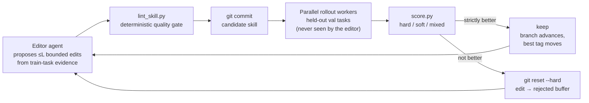

<p align="center">
  
</p>

<div align="center">

# skill-trainer

**Your agent's `SKILL.md` is a guess. Train it until it's a measurement.**

An agent-driven hill-climbing loop that trains skill files against scored
task suites. Git is the checkpoint mechanism, markdown is the model, and
every accepted edit earned its place on a held-out validation set.

Works with **Claude Code**, **Codex**, **GitHub Copilot**, and **Cursor** —
your coding agent is the editor, the rollout worker, and the manager.

[](https://github.com/shahshrey/skill-trainer/actions/workflows/tests.yml)
[](https://www.python.org)
[](LICENSE)
[](CONTRIBUTING.md)

**[Run it now](#run-it-now)** · **[How it works](#how-it-works)** · **[Bring your own task](#bring-your-own-task-suite)** · **[Launch a training run](#launch-a-real-training-run)**

</div>

---

Skills today are written once, by feel, and never verified. skill-trainer
closes the loop: propose a small edit, run the candidate against tasks the
editor never saw, keep it only if the score strictly improves. Rejected
edits roll back with `git reset --hard` and get fed to future editors as
evidence of what didn't work.

Zero framework dependencies. The harness is plain Python (stdlib + numpy),
the optimizer is a manager agent following [`PROGRAM.md`](PROGRAM.md), and
everything that "learns" is markdown. All model work goes through the agent
CLI you already have — `claude -p`, `codex exec`, `copilot`, or
`cursor-agent` — so training runs on the same models and subscription your
coding agent uses.

## Run it now

Start with the framework's own test suite — the one part of skill-trainer
that uses no models at all (deterministic, mock backend):

```bash
git clone https://github.com/shahshrey/skill-trainer
cd skill-trainer
uv venv .venv && uv pip install -r requirements-dev.txt -p .venv/bin/python
.venv/bin/python -m pytest tests/        # 123 tests: gates, edits, lint, audits
```

Then watch it actually train — from here on, real models are doing the
work through your agent CLI. The meta-eval deletes a known-good rule from
a reference skill and measures whether the loop can rediscover it from
failure symptoms alone. The editor runs on Claude Code (`claude -p`);
rollouts are mocked, so it's cheap:

```bash
.venv/bin/python tests/meta_eval.py planted --ablate seamless-loop --max-steps 8
```

And the null test, the one most optimizers fail, checks that on a
pure-noise suite the trainer correctly accepts ~nothing:

```bash
.venv/bin/python tests/meta_eval.py null --max-steps 5
```

## How it works



1. An editor agent proposes a small set of bounded edits to `SKILL.md`,
   grounded in failure and success evidence from training tasks.
2. The manager applies them, runs the lint gate, and commits the
   candidate.
3. Parallel rollout workers run the candidate against a held-out
   validation set. `score.py` turns the outputs into a number,
   deterministically, with no LLM judging.
4. If the candidate is strictly better, the branch advances. Otherwise
   `git reset --hard`, and the rejected edit text goes into a buffer
   future editors read.
5. Every step lands in `results.tsv`. Every E steps, an epoch boundary runs
   a slow-update regression check and refreshes the optimizer's own memory
   (`META.md`).

The manager is expected to die (context exhaustion, sleep, API errors).
`train.sh` relaunches it until a terminal state exists, and the resume
ritual in `PROGRAM.md` §0 reconstructs everything from disk. Training runs
live on branches named `train/<skill-name>/<tag>`.

The guardrails are structural, not aspirational: the editor never sees val
tasks, the manager cannot modify the harness or the task suite, scores
never compare across gate modes, and post-run audits
(`harness/audit_run.py`) grep for leakage.

## Bring your own task suite

This repo is the framework only (see `PROGRAM.md` §8). Task suites and
the skills they train live in your working copy; `tasks/` and `skills/`
are gitignored here by design. A suite is a directory:

```
tasks/<skill-name>/
  train.jsonl        tasks the editor learns from
  val.jsonl          held-out gate tasks; the editor NEVER sees these
  test.jsonl         optional final held-out set
  scoring.md         scoring contract: suite config (first fenced json
                     block), smoke_tools, example-template packaging rules
  rubric.py          score(task, workdir, mode) -> {hard, soft, checks}
                     (only needed for rubric-mode scoring)
  requirements.txt   suite-specific deps (installed into .venv)
  refs/              any reference files tasks list under "files"
```

Each line of a `.jsonl` file is a task: `{"id": ..., "prompt": ...,
"files": [...], "scoring": {...}}`. Four scoring modes are built in:
`exact` (regex on output), `checklist` (required substrings), `command`
(exit code), and `rubric` (your `rubric.py`). Scoring is deterministic and
makes no LLM calls.

The skill being trained lives at `skills/<skill-name>/SKILL.md`, with
optimizer memory in `META.md` beside it.

## Launch a real training run

```bash
# One-time: verify tooling against your suite
.venv/bin/python harness/run_task.py --smoke --suite tasks/<skill> --backend claude

# Launch; keeps the manager alive until a terminal state.
# The third argument picks the agent: claude | codex | copilot | cursor-agent
./train.sh <skill-name> <tag> claude
```

Before a real run, copy `runs/CONFIG_TEMPLATE.md`'s JSON into
`runs/<tag>/config.json`. Every field pattern in it earned its place in a
live run. The manager reads `PROGRAM.md` and takes it from there; it will
not stop until `runs/<tag>/TERMINAL` exists.

## Layout

```
PROGRAM.md            manager agent instructions (the heart)
train.sh              relaunch wrapper; keeps the manager alive
prompts/              worker prompt templates (editor, ranker, rollout, ...)
harness/              the ONLY Python code; read-only during training
runs/CONFIG_TEMPLATE.md  canonical run config, distilled from live runs
tests/                deterministic framework tests + meta_eval.py
tasks/<name>/         your task suites (gitignored; yours to provide)
skills/<name>/        SKILL.md (trainable) + META.md (optimizer memory)
runs/<tag>/           per-run artifacts (gitignored)
results.tsv           training log (untracked)
```

`harness/` and `tasks/*/val.jsonl` are ground truth: the manager must never
modify them, and the editor must never see val task contents.

Rollout batches go through `harness/rollout_batch.py`: N parallel
private-workspace workers with heartbeat supervision (a stale worker is
killed and requeued once). `harness/harvest.py` mines Claude/Codex/Cursor
session transcripts for recurring requests to grow task suites from
(≥2 distinct sessions before a candidate is emitted; a human curates).

## Contributing

Harness improvements, new scoring modes, new agent backends, and doc fixes
are all welcome. See [CONTRIBUTING.md](CONTRIBUTING.md). The one rule:
`tests/` must stay deterministic and LLM-free.

---

<div align="center">

**[Star the repo](https://github.com/shahshrey/skill-trainer/stargazers)** if you'd rather measure skills than guess at them.

<sub>MIT · See <a href="LICENSE">LICENSE</a></sub>

</div>
