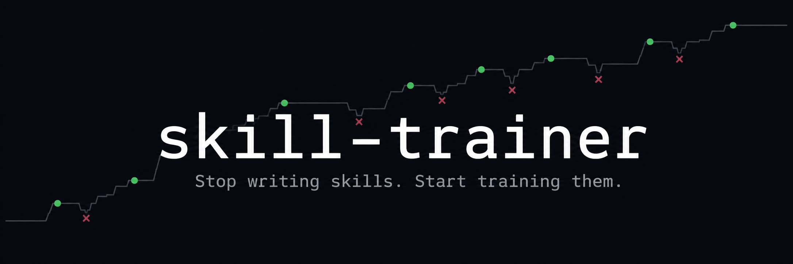
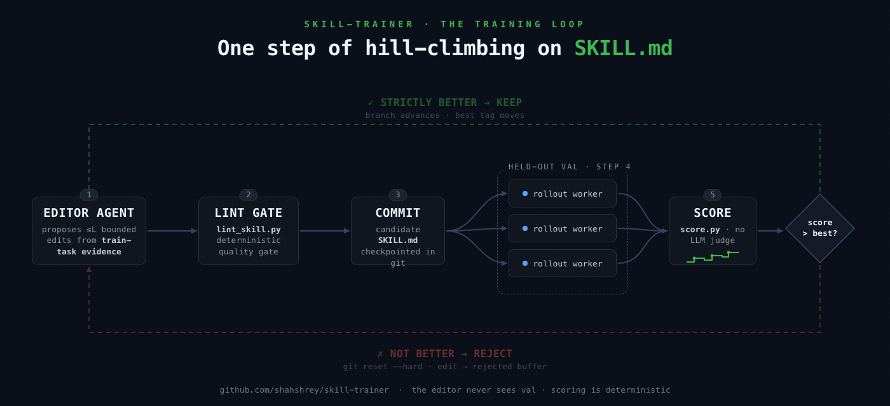

<p align="center">
  
</p>

<div align="center">

# skill-trainer

**Your agent's `SKILL.md` is a guess. Train it until it's a measurement.**

An agent-driven hill-climbing loop that trains skill files against scored
task suites. Git is the checkpoint mechanism, markdown is the model, and
every accepted edit earned its place on a held-out validation set.

Works with Claude Code, Codex, GitHub Copilot, Cursor, and opencode. Your
coding agent is the editor, the rollout worker, and the manager.

[](https://github.com/shahshrey/skill-trainer/actions/workflows/tests.yml)
[](https://www.python.org)
[](LICENSE)

**[Run it now](#run-it-now)** · **[How it works](#how-it-works)** · **[What a run produces](#what-a-run-produces)** · **[Bring your own task](#bring-your-own-task-suite)** · **[Launch a training run](#launch-a-real-training-run)**

</div>

---

Skills today are written once, by feel, and never verified. skill-trainer
closes the loop: propose a small edit, run the candidate against tasks the
editor never saw, keep it only if the score strictly improves. Rejected
edits roll back with `git reset --hard` and get fed to future editors as
evidence of what didn't work.

Zero framework dependencies. The harness is plain Python (stdlib + numpy),
the optimizer is a manager agent following [`PROGRAM.md`](PROGRAM.md), and
everything that "learns" is markdown. All model work goes through the agent
CLI you already have — no API keys beyond the CLIs themselves, billed on
the same models and subscription your coding agent already uses.

## Prerequisites

- Python 3.11+ and git.
- At least one agent CLI installed and authenticated: `claude`, `codex`,
  `copilot`, `cursor-agent`, or `opencode`.
- Any platform with bash. On macOS, `train.sh` additionally blocks system
  sleep (via `caffeinate`) so overnight runs survive; elsewhere it runs
  unwrapped.

## Run it now

Start with the framework's own test suite — deterministic, mock backend,
no model calls:

```bash
git clone https://github.com/shahshrey/skill-trainer
cd skill-trainer

# with uv:
uv venv .venv && uv pip install -r requirements-dev.txt -p .venv/bin/python
# or with plain pip:
python3 -m venv .venv && .venv/bin/pip install -r requirements-dev.txt

.venv/bin/python -m pytest tests/
```

Then watch it actually train, using the bundled example suite
([`examples/mock-demo`](examples/mock-demo)). The meta-eval deletes a
known-good rule from the reference skill and measures whether the loop can
rediscover it from failure symptoms alone. Rollouts stay mocked; only the
editor makes model calls (through `claude -p`), so it costs a handful of
prompts:

```bash
.venv/bin/python tests/meta_eval.py planted --ablate seamless-loop --max-steps 8
```

And the null test, the one most optimizers fail, checks that on a
pure-noise suite the trainer correctly accepts ~nothing:

```bash
.venv/bin/python tests/meta_eval.py null --max-steps 5
```

## How it works

<p align="center">
  
</p>

1. An editor agent proposes a small set of bounded edits to `SKILL.md`,
   grounded in failure and success evidence from training tasks.
2. The manager applies them, runs the lint gate, and commits the
   candidate.
3. Parallel rollout workers run the candidate against a held-out
   validation set. `score.py` turns the outputs into a number,
   deterministically, with no LLM judging.
4. If the candidate is strictly better, the branch advances. Otherwise
   `git reset --hard`, and the rejected edit text goes into a buffer
   future editors read.
5. Every step lands in `results.tsv`. Every E steps, an epoch boundary runs
   a slow-update regression check and refreshes the optimizer's own memory
   (`META.md`).

The manager is expected to die (context exhaustion, sleep, API errors).
`train.sh` relaunches it until a terminal state exists, and the resume
ritual in `PROGRAM.md` §0 reconstructs everything from disk. Training runs
live on branches named `train/<skill-name>/<tag>`.

The guardrails are structural, not aspirational: the editor never sees val
tasks, the manager cannot modify the harness or the task suite, scores
never compare across gate modes, and post-run audits
(`harness/audit_run.py`) grep for leakage.

## What a run produces

- **The trained skill**, at `skills/<skill-name>/SKILL.md` on the
  `train/<skill-name>/<tag>` branch. Best checkpoints are git-tagged; every
  accepted step is a commit you can diff to see exactly what the training
  changed and why.
- **`results.tsv`** — one append-only row per step: commit, epoch, step,
  gate mode, val scores (mixed/hard/soft), rollout count, keep/discard
  status, and a one-line description of the edits tried.
- **`runs/<tag>/`** — per-step artifacts: rollout workspaces, editor
  transcripts, score reports, and finally `TERMINAL`, a one-line
  `<state>: <reason>` file (`success`, `no-progress`, `blocked`, ...)
  that is the only way a run ends.

### What it costs

The test suite and all mock rollouts are free — no model calls at all. The
meta-eval makes a few editor calls per step through `claude -p`. A real
training run is the expensive mode: each step is roughly one editor call
plus K × |val| rollouts through your agent CLI, so an overnight run means
hundreds of rollouts on your existing subscription. Size K, the val set,
and `--max-steps` accordingly; there is no separate API bill.

## Bring your own task suite

This repo is the framework only (see `PROGRAM.md` §8). Task suites and
the skills they train live in your working copy; `tasks/` and `skills/`
are gitignored here by design. The bundled
[`examples/mock-demo`](examples/mock-demo) is a complete working suite to
copy as a starting point. A suite is a directory:

```
tasks/<skill-name>/
  train.jsonl        tasks the editor learns from
  val.jsonl          held-out gate tasks; the editor NEVER sees these
  test.jsonl         optional final held-out set
  scoring.md         scoring contract: suite config (first fenced json
                     block), smoke_tools, example-template packaging rules;
                     judge keys: soft_source, judge_samples, judge_backend
  rubric.py          score(task, workdir, mode) -> {hard, soft, checks}
                     (only needed for rubric-mode scoring)
  requirements.txt   suite-specific deps (installed into .venv)
  refs/              any reference files tasks list under "files"
```

Each line of a `.jsonl` file is a task: `{"id": ..., "prompt": ...,
"files": [...], "scoring": {...}}`. Four scoring modes are built in:
`exact` (regex on output), `checklist` (required substrings), `command`
(exit code), and `rubric` (your `rubric.py`). Scoring itself is
deterministic and makes no LLM calls. For skills whose quality can't be
checked mechanically, a suite can opt in to **judge scoring**:
`"soft_source": "judge"` plus binary criteria in the task's scoring block,
and `harness/judge.py` (run automatically by `rollout_batch.py --score`)
asks your agent CLI to grade each output against those criteria — N samples,
majority vote, cached by output hash, written to `judge.json` for `score.py`
to read. The `hard` score always stays programmatic.

**Choosing your scoring:** if success is mechanically verifiable (a string
appears, a file exists, a command exits 0), use the programmatic modes —
free, deterministic, unhackable. If success is inherently a quality judgment
(tone, coherence, "followed the spirit of the workflow"), programmatic checks
can't measure it: use judge scoring for `soft` and keep the strongest
programmatic check you have for `hard`. If an agent is helping you set up a
suite, it should put this choice to you explicitly — never pick silently.
`run_task.py --smoke` warns about tasks with weak deterministic signal.
Judge-scored suites should set a slightly larger `min_delta` in `config.json`
to absorb residual judge variance.

The skill being trained lives at `skills/<skill-name>/SKILL.md`, with
optimizer memory in `META.md` beside it.

## Launch a real training run

```bash
# One-time: verify tooling against your suite
.venv/bin/python harness/run_task.py --smoke --suite tasks/<skill> --backend claude

# Launch; keeps the manager alive until a terminal state.
# The third argument picks the agent: claude | codex | copilot | cursor | opencode
# Optional args 4-6: manager model, rollout model, reasoning effort.
./train.sh <skill-name> <tag> claude
./train.sh <skill-name> <tag> codex gpt-5.3
./train.sh <skill-name> <tag> cursor claude-sonnet-5-low
```

Before a real run, copy `runs/CONFIG_TEMPLATE.md`'s JSON into
`runs/<tag>/config.json` and adjust it for your suite. The manager reads
`PROGRAM.md` and takes it from there; it will not stop until
`runs/<tag>/TERMINAL` exists.

## Layout

```
PROGRAM.md            manager agent instructions; the whole loop is here
train.sh              relaunch wrapper; keeps the manager alive
prompts/              worker prompt templates (editor, ranker, rollout, ...)
harness/              the ONLY Python code; read-only during training
examples/mock-demo/   complete example suite; template + meta-eval fixture
runs/CONFIG_TEMPLATE.md  canonical run config
tests/                deterministic framework tests + meta_eval.py
tasks/<name>/         your task suites (gitignored; yours to provide)
skills/<name>/        SKILL.md (trainable) + META.md (optimizer memory)
runs/<tag>/           per-run artifacts (gitignored)
results.tsv           training log (untracked)
```

`harness/` and `tasks/*/val.jsonl` are ground truth: the manager must never
modify them, and the editor must never see val task contents.

Rollout batches go through `harness/rollout_batch.py`: N parallel
private-workspace workers with heartbeat supervision (the dispatcher kills
a stale worker and requeues it once).

## Contributing

Harness improvements, new scoring modes, new agent backends, and doc fixes
are all welcome. See [CONTRIBUTING.md](CONTRIBUTING.md). The one rule:
`tests/` must stay deterministic and LLM-free.

---

<div align="center">
<sub>MIT · See <a href="LICENSE">LICENSE</a></sub>
</div>
