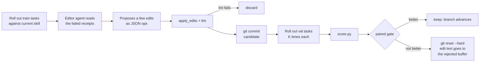

# 1. Why train a skill

A `SKILL.md` is a set of instructions your agent reads before it works.
You wrote yours from memory of what went wrong last time. That is a fine
way to start and a bad way to stop, because nothing ever tells you which
lines are pulling their weight.

skill-trainer turns skill writing into measurement. You give it tasks
with checkable answers. It proposes a small edit, runs the edited skill
against tasks it has not seen, and keeps the edit only if the score went
up. Everything else it throws away.

## One training step

Read it left to right.

The editor never sees the whole picture. It gets receipts from training
rollouts that failed, the current skill, and a list of edits that were
tried before and rejected. From that it proposes a handful of edits, as
JSON operations on the skill text (append a line, replace a line, delete
one). It cannot rewrite the file freehand.

The edits are applied mechanically and linted. Then the candidate skill
is committed and run against the validation set, which the editor is
never shown. The score comes from a script, not from anyone's opinion.
A paired gate compares the candidate to the incumbent on the same
tasks and seeds and decides whether the difference is real.

If it is, the branch moves forward. If not, `git reset --hard` puts the
skill back exactly where it was, and the text of the rejected edit is
kept in a buffer so the next editor does not try it again.

## Why two sets of tasks

Train tasks are what the editor learns from. Val tasks are what the
gate scores. They must be different, and the editor must never see val.

The reason is the same as in any learning system. An editor that can see
the test can write rules that pass the test. "When asked for total
revenue, answer 7577.39" would score perfectly and be useless. Keeping
val hidden forces the editor to write rules that generalize.

skill-trainer enforces this structurally. The manager agent that runs the
loop is told it may not read `val.jsonl`. Post-run audits grep the editor
prompts for val task text. A rule you have to remember is a rule that
gets broken at 3am.

## Why git is the checkpoint

Every accepted step is a commit on a branch named
`train/<skill>/<tag>`. The best score so far is a tag. This gives you
three things for free.

You can diff any two points in training and see exactly what changed and
why. Commit messages carry the edit descriptions.

Rejection is a reset. There is no "undo" logic to get wrong; a rejected
candidate is a commit that never made it onto the branch.

The run can die and come back. The manager agent is an LLM session, and
sessions end: context fills up, laptops sleep, APIs time out. Everything
the run knows is on disk and in git, so a relaunched manager reads the
branch, the results log, and any pending step and picks up where the
last one stopped.

## What the score is

Every task yields two numbers. `hard` is 0 or 1: did the rollout fully
solve it. `soft` is 0.0 to 1.0: how close it got. The gate metric is
`mixed`, a weighted blend of the two averaged over every val rollout.
The weight lives in the suite's `scoring.md` and defaults to half and
half.

`hard` is what you care about. `soft` exists so the loop has a gradient:
an edit that turns "did not run" into "ran but wrong" is progress the
gate can see, even though nothing is solved yet.

## What the trainer will not do for you

It will not invent the tasks. It will not invent the scorer. Those are
the work, and chapter 4 is about doing them well.

It will not make a bad scorer honest. If your rubric passes wrong answers,
the loop will find the cheapest way to produce those wrong answers and
call it a win. Chapter 4 spends time on this because it is where most
first attempts go wrong.

It will not make a skill smarter than the model running it. Training
finds the instructions the model needed and did not have. It cannot
teach SQL to a model that does not know SQL.

Next: [Setup and first run](02-setup-and-first-run.md).
