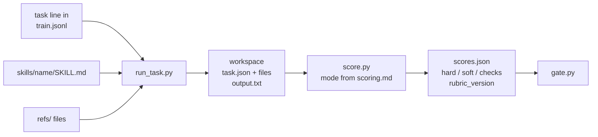

# 3. Anatomy of a suite

A suite is a directory under `tasks/` named after the skill it trains.
This chapter walks through the bundled `examples/mock-demo` file by
file, because it is the smallest complete suite in the repo and the one
the meta-eval in chapter 2 ran on. Chapter 4 builds a real one.

```
tasks/mock-demo/
  train.jsonl          tasks the editor learns from
  val.jsonl            held-out gate tasks; the editor never sees these
  scoring.md           scoring contract: suite config + how scoring works
  failure_classes.md   symptom -> mechanism guide, pasted into editor prompts
skills/mock-demo/
  SKILL.md             the thing being trained
  META.md              optimizer memory, rewritten at epoch boundaries
```

A real suite can also carry `test.jsonl` (a final held-out set the run
never gates on), `rubric.py` (a scorer), `requirements.txt` (suite deps),
`judge.md` (an LLM judge prompt) and a `refs/` directory of files tasks
need.

## A task is one JSON line

```json
{"id": "train-cite-your-sources",
 "prompt": "Write a short explainer on cache invalidation strategies.",
 "requires": ["cite-your-sources"],
 "match_regex": {"cite-your-sources": ["cit(e|ation|ing)", "source|claim|fact"]},
 "failure_hints": {"cite-your-sources": "the document states figures and quotes with nothing backing them up"},
 "noise": 0,
 "scoring": {"required": ["PASS:cite-your-sources", "RESULT: solved"]}}
```

Three fields matter to the harness. `id` names the workspace a rollout
runs in. `prompt` is what the agent is asked. `scoring` says how to
grade the reply. Everything else is the suite's own business; here,
`requires`, `match_regex`, `failure_hints` and `noise` drive the mock
backend, which fakes an agent by checking whether the skill text still
contains the rule the task needs.

Two optional fields the harness does read: `files` lists paths under the
suite that get copied into the workspace before the agent runs, and
`suite` tags the task for a two-suite gate (a `primary` and a
`secondary`, when a run wants to protect one behavior while training
another). A task without `suite` is primary.

## How a task becomes a score



`run_task.py` makes a workspace, copies the task's files in, injects the
skill text into the agent call, and captures the reply as
`output.txt`. `score.py` reads the workspace and the suite's scoring
contract and writes numbers. `gate.py` compares numbers. Each stage is a
script you can run by hand, which is how chapter 4 debugs a suite.

## Five ways to score

`score.py` reads `scoring.mode` from the task, falling back to
`default_mode` in `scoring.md`. Each mode produces `hard` and `soft`.

| mode | task field | hard | soft |
|---|---|---|---|
| `exact` | `expected`: a regex searched in the output | 1 if found | same |
| `checklist` | `required`: substrings | 1 if all present | fraction present |
| `command` | `command`: shell, cwd = workspace, `$TASK_OUTPUT` set | 1 on exit 0 | same |
| `rubric` | none; `rubric.py::score(task, workdir, mode)` decides | as returned | as returned |
| `judge` | `reference`, `judge_inputs`; `judge.md` is the prompt | majority of samples pass | mean weighted criteria |

The first four are deterministic and make no model calls. Prefer them.
`checklist` covers more than it looks like: a task whose correct answer
must mention four specific things is a checklist. `command` covers
anything a test script can decide. `rubric` is for when you need
partial credit or a diff, which is chapter 4. `judge` is chapter 6.

Pick the mode per suite, not per task, unless you have a reason. Scores
are only comparable within a mode.

## scoring.md is a contract

The first fenced JSON block is the suite config:

```json
{
  "default_mode": "checklist",
  "mixed_weight": 0.5,
  "smoke_tools": []
}
```

`mixed_weight` is the weight on `soft` in the gate metric. `smoke_tools`
lists binaries the suite needs on the path; the smoke check in chapter 5
fails early if they are missing.

The prose after the block explains how a rollout is scored and what the
checks mean. It is worth writing well, for two reasons. The manager
agent reads it at setup. And `score.py` hashes `scoring.md` together
with `rubric.py` and `judge.md` into a `rubric_version` stamp on every
score report. Change the contract and the stamp changes, and the gate
refuses to compare reports across stamps. That is by design: a score
under one rubric says nothing about a score under another.

## SKILL.md has a protected block

```markdown
---
name: mock-demo
description: Reference skill for the trainer's meta-evaluation. ... Use when validating the training loop itself rather than training a real skill.
---

# mock-demo

## Rules

- Cite your sources for every factual claim.
- When options exist, state a default and move on.
...

<!-- PROTECTED:SLOW_UPDATE:START -->
## Conventions (slow update)
...
<!-- PROTECTED:SLOW_UPDATE:END -->
```

The frontmatter is what your agent CLI reads to decide when to load the
skill. The lint gate checks it: a lowercase hyphenated `name`, a
`description` that says what the skill does and when to use it, no
first or second person.

The body between the frontmatter and the protected markers is the
trainable region. Per-step editors own it. The `SLOW_UPDATE` block is
rewritten only at epoch boundaries, by a separate worker with a wider
view, and per-step edits that touch it are rejected mechanically. Keep
structural conventions there and rules in the body.

`META.md` beside it is the optimizer's notebook. The manager rewrites it
at every epoch boundary with what worked, what did not, and what val
kept failing. It is never shown to the agent doing tasks.

## failure_classes.md tells the editor where to look

```
| class | symptom looks like | mechanism |
|---|---|---|
| unsupported-claims | figures or quotes with nothing backing them | the document workflow lacks an evidence step |
| open-choices | reader left with an option list and no guidance | the document never commits to a recommendation |
```

The editor gets failed receipts. A receipt says which checks failed,
not why. This table bridges the two: the mechanism column says which
part of the skill to think about. It deliberately does not say what to
write. If it did, the editor would paste it and the loop would be
copying your answers, not learning.

## What val hygiene means in practice

Three rules, all enforced by the harness or the audit, none of which
you should test.

The editor prompt never contains val task text. The manager fills editor
prompts from train receipts only.

The manager never modifies `tasks/`, `harness/`, or `prompts/` during a
run. They are read-only ground truth.

Example templates cloned into the skill package (some suites allow this)
may only come from train rollouts. Cloning a val answer into the skill
would deploy the answer and void the gate.

Next: [Build your own suite](04-build-your-own-suite.md).
